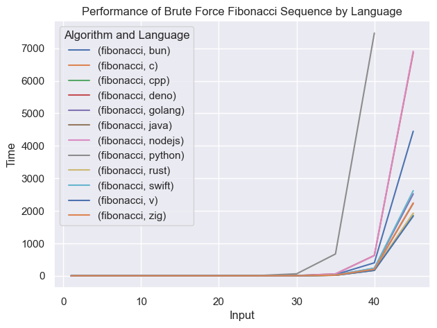
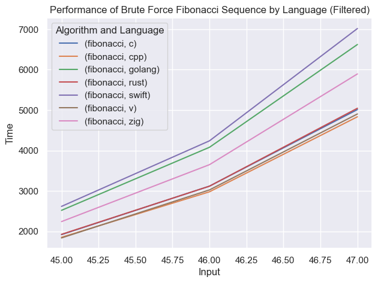

# Language Benchmark

This is a programming language benchmark project. I will include multiple types of algorithm to test different aspects of programming languages.

## Tests

1. Fibonacci Sequence (Brute Force)

## Project Structure

`benchmarks/<language>/<algorithm>` is the main folder structure for benchmark source code. The folder names will be used as IDs in database.

Input

```json


```

Output

```json
{
  "time": [
    { "input": 1, "time": 1000 },
    { "input": 2, "time": 2000 }
  ]
}
```

## Results

|                         |           1 |           5 |          10 |         15 |        20 |       25 |       30 |       35 |       40 |      45 |      46 |      47 |
|:------------------------|------------:|------------:|------------:|-----------:|----------:|---------:|---------:|---------:|---------:|--------:|--------:|--------:|
| ('fibonacci', 'bun')    | 0.00309733  | 0.000458333 | 0.0117223   | 0.0435417  | 0.0526667 | 0.397125 |  3.33957 |  36.2151 |  398.431 | 4447.57 |  nan    |  nan    |
| ('fibonacci', 'c')      | 0           | 0           | 0           | 0          | 0.0133333 | 0.15     |  1.61333 |  15.7533 |  172.743 | 1918.78 | 3118.1  | 5012.69 |
| ('fibonacci', 'cpp')    | 0.00141667  | 0.000749667 | 0.000722333 | 0.00170833 | 0.012319  | 0.128347 |  1.35783 |  15.074  |  167.48  | 1852.48 | 2978.09 | 4834.1  |
| ('fibonacci', 'deno')   | 0.00419433  | 0.000778    | 0.00206933  | 0.030236   | 0.0883887 | 0.488736 |  4.96279 |  57.1126 |  624.646 | 6868.81 |  nan    |  nan    |
| ('fibonacci', 'golang') | 0.003486    | 5.5e-05     | 0.000180333 | 0.001514   | 0.0166667 | 0.171319 |  2.00122 |  25.7781 |  228.782 | 2519.27 | 4079.35 | 6622.45 |
| ('fibonacci', 'java')   | 0.000347667 | 0.000236    | 0.001278    | 0.013597   | 0.146778  | 0.170986 |  1.74762 |  18.2075 |  199.422 | 2225.13 | 3539.27 | 5738.9  |
| ('fibonacci', 'nodejs') | 0.002153    | 0.012222    | 0.000930333 | 0.00684733 | 0.140792  | 0.63218  |  5.1645  |  56.8449 |  621.321 | 6912    |  nan    |  nan    |
| ('fibonacci', 'python') | 0.000397364 | 0.000874201 | 0.00413259  | 0.042359   | 0.486533  | 5.41433  | 60.2611  | 670.417  | 7470.31  |  nan    |  nan    |  nan    |
| ('fibonacci', 'rust')   | 4.13333e-05 | 6.93333e-05 | 0.000319333 | 0.002028   | 0.0194587 | 0.203417 |  2.2001  |  19.672  |  174.689 | 1925.72 | 3117    | 5045.29 |
| ('fibonacci', 'swift')  | 1.4e-05     | 4.13333e-05 | 0.000194333 | 0.00156933 | 0.0170413 | 0.185931 |  2.00579 |  21.3121 |  235.355 | 2617.04 | 4239.16 | 7017.36 |
| ('fibonacci', 'v')      | 0           | 0           | 0           | 0          | 0         | 0        |  1.33333 |  16      |  165.667 | 1836.67 | 3024.67 | 4903.67 |
| ('fibonacci', 'zig')    | 2.76667e-05 | 2.76667e-05 | 0.000166667 | 0.001194   | 0.0137777 | 0.159347 |  1.63582 |  18.1258 |  201.962 | 2240.93 | 3649.37 | 5894.27 |




